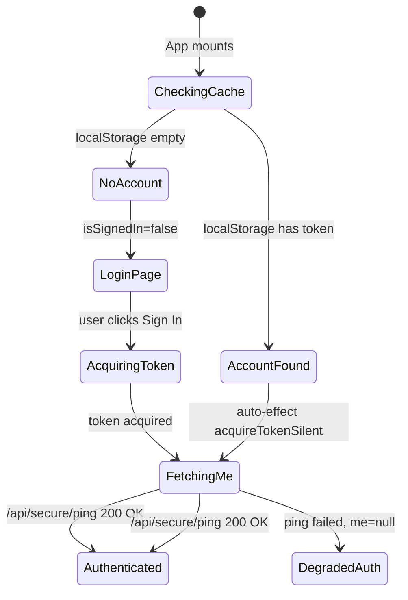

# Frontend Authentication Flow

> Analysis task — no code changes.

## Overview

Authentication is handled by **Azure Entra ID (MSAL)** via `@azure/msal-browser` + `@azure/msal-react`.
The frontend distinguishes two separate questions:

| Question | Signal | Source |
|---|---|---|
| "Does MSAL have a cached account for this browser?" | `isSignedIn` | `accounts[0]` from `useMsal()` |
| "Does our backend recognize this token and what roles does the user have?" | `me` object | GET /api/secure/ping |

Both must resolve before the app renders any protected content.

---

## Sequence: App Load to Authenticated State

### 1. MSAL Initialization (main.tsx)

```
new PublicClientApplication(msalConfig)
```

- Reads `VITE_AZURE_TENANT_ID`, `VITE_AZURE_CLIENT_ID`, `VITE_REDIRECT_URI`, `VITE_API_APP_ID_URI` from `.env.local`.
- Configures the Entra authority URL: `https://login.microsoftonline.com/<tenant>`.
- Sets `cacheLocation: "localStorage"` — tokens persist across hard refreshes.
- The `pca` instance is passed to `MsalProvider`, making MSAL state globally available via React context.

### 2. Provider Tree Mount

```
ErrorBoundary
  MsalProvider (instance={pca})   <- injects accounts[], instance
    AuthProvider                   <- wraps MSAL with app-level auth logic
      App
```

### 3. AuthProvider Evaluates Initial Account State (AuthContext.tsx:28-34)

```ts
const { instance, accounts } = useMsal();
const account  = (accounts && accounts[0]) || null;
const isSignedIn = !!account;
```

- `accounts` is populated **synchronously** by MSAL from `localStorage` on mount.
- If the user previously signed in and the session token is still in localStorage, `account` is non-null immediately — **no network call at this step**.
- `isSignedIn` is therefore a purely local, cache-based boolean.

### 4. Auto-Identity Fetch (AuthContext.tsx:99-104)

```ts
useEffect(() => {
  if (isSignedIn && !me && !isLoading) {
    setIsLoading(true);
    fetchMe().finally(() => setIsLoading(false));
  }
}, [isSignedIn, me, isLoading, fetchMe]);
```

Triggered whenever MSAL has an account but `me` (the backend identity) is missing:

1. `getAccessToken()` is called first.
2. MSAL attempts `acquireTokenSilent` using the `access_as_user` scope.
   - Valid refresh token -> returns an access token silently (no UI).
   - Interaction required -> falls back to `acquireTokenPopup`.
3. The access token is attached to `GET /api/secure/ping`.
4. On 200 OK, the response `{ ok, roles, user }` is saved to `me` state.
5. `isLoading` is set back to `false`.

### 5. App.tsx Render Gate

```tsx
if (isLoading) {
  return <div>Loading identity...</div>;   // spinner while fetchMe is in flight
}

if (!isSignedIn) {
  return <LoginPage onSignIn={signIn} />;  // no MSAL account -> show login
}

// isSignedIn=true and isLoading=false -> render the app
```

> **Note**: The app renders protected content as soon as `isSignedIn=true` and `isLoading=false`, even if `me` is still null. Role-dependent UI degrades gracefully since `roles` defaults to `[]`.

### 6. Role-Based View Selection (App.tsx:38-45)

```ts
const roles   = me?.roles || [];
const isAdmin = roles.includes("Admin");
const isLead  = roles.includes("Lead");
const isUL    = roles.includes("UL");

useEffect(() => {
  if (isSignedIn && !isLoading) {
    if (isAdmin) setActiveView("admin_dash");
    else if (isLead) setActiveView("routes");
    else setActiveView("work");
  }
}, [isSignedIn, isAdmin, isLead, isLoading]);
```

Once `me` arrives with role data, this effect fires and routes the user to their default view.

---

## Explicit Sign-In Flow (signIn)

Triggered when the user clicks **Sign in** on LoginPage:

```ts
const signIn = async () => {
  const result = await instance.loginPopup({ scopes: [...basicScopes, ...apiScopes] });
  if (result.account) instance.setActiveAccount(result.account);
  setIsLoading(true);
  await fetchMe();
  setIsLoading(false);
};
```

1. Opens the Entra login popup.
2. On success, sets the active account in MSAL.
3. Eagerly calls `fetchMe()` so `me` is hydrated before the loading spinner disappears.

---

## Token Acquisition Detail (getAccessToken)

```
acquireTokenSilent (hidden iframe / cache)
    success -> access token returned
    interaction_required
acquireTokenPopup (user sees a dialog)
    sets active account
    returns access token
```

- A **de-duplication ref** (`inflightToken`) prevents concurrent token requests for the same account from racing — the second caller reuses the in-flight promise.
- The silent redirect URI is `<origin>/auth-silent.html`.

---

## Role Guard (RequireRole.tsx)

A lightweight wrapper used by individual components:

```ts
const allowed = roles.some(r => anyOf.includes(r) || r === "Admin");
if (!allowed) return null;
```

Admin is implicitly allowed for every role gate.

---

## State Machine Summary



---

## Key Files

| File | Role |
|---|---|
| `msalConfig.ts` | MSAL instance config and scope definitions |
| `main.tsx` | Instantiates PCA, wraps tree in MsalProvider + AuthProvider |
| `auth/AuthContext.tsx` | Core auth logic: isSignedIn, getAccessToken, fetchMe, signIn, signOut |
| `App.tsx` | Render gate and role-based view selection |
| `auth/LoginPage.tsx` | Unauthenticated landing screen |
| `auth/RequireRole.tsx` | Component-level role guard |
